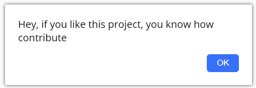
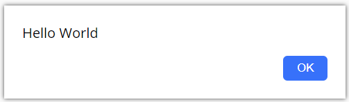
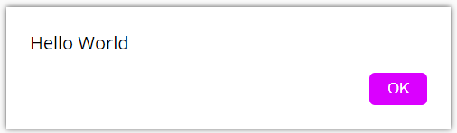
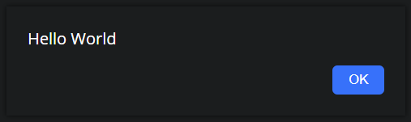
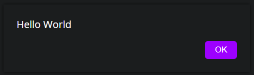

<h1 align="center">
  Custom Alert Library <br>
  
</h1>

<p align="center">
  <a href="#-API-Preview">Library preview</a>&nbsp;&nbsp;&nbsp;|&nbsp;&nbsp;&nbsp;
  <a href="#How-to-use">How to use</a>&nbsp;&nbsp;&nbsp;|&nbsp;&nbsp;&nbsp;
  <a href="#Contributing">Contributing</a>&nbsp;&nbsp;&nbsp;|&nbsp;&nbsp;&nbsp;
  <a href="#memo-licença">License</a>
</p>

<p align="center">
 

  
</p>

## 💻 Library Preview

With this Library you can display some alerts, with your style, if you want a new feature, open an PR or an Issue!
Below you can see some styles that I made.
You can test clicking [here](https://igorvini25.github.io/Custom-alert/pages/preview.html)!

<div align="center">
Normal<br>
<br>
Custom Style<br>
<br>
Custom Style<br>
<br>
Custom Style<br>
<br>
</div>

---

## How to Use

To use the Library it's very simple!

1 - Import the Library
<br>

Normal Library file

```html
<!-- Script -->
<script defer src="https://igorvini25.github.io/Custom-alert/files/customAlert.js"></script>
<!-- Css -->
<link rel="stylesheet" href="https://igorvini25.github.io/Custom-alert/files/customAlert.css"/>
```

Minify Library file

```html
<!-- Script -->
<script defer src="https://igorvini25.github.io/Custom-alert/files/customAlert.min.js"></script>
<!-- Css -->
<link rel="stylesheet" href="https://igorvini25.github.io/Custom-alert/files/customAlert.min.css"/>
```

<br>

2 - configs

```js
// If you dont want custom colors, put false in 'customColors' and ignore
// colors object

// Create Config Object
let alertConfig = {
  // If true, the user can't click in page until the alert is closed
  blockPage: true,
  buttonText: true,
  customColors: true,
    colors: {
      // If you don't want style something you can put 'false' in configs
      backgroundColor: /* your color */,
      textColor: /* your color */,
      buttonColor: /* your color */,
      buttonTextColor: /* your color */
    }
}
```

<br>

Now you can Use the alert

```js
// Call the function, and all is ready
showAlert('Your Message')

// If you put 'true' in buttonText you can use the alert like below
showAlert('Your Message', 'Button text')
```

If you want close the Alert without click, you can use the call the function `closeAlert()` 

---

## Contributing

You can Contribute with new features, features suggestions or translations!

1. Fork it (<https://github.com/IgorVini25/Custom-alert/fork>)
2. Create your feature branch (`git checkout -b featureOrTranslation`)
3. Commit your changes (`git commit -am 'Add some feature'`)
4. Push to the branch (`git push origin feature`)
5. Create a new Pull Request

---

## :memo: License

This project License is MIT. See [LICENSE](LICENSE) File for more details.

Made with ♥ by IgorVini25
